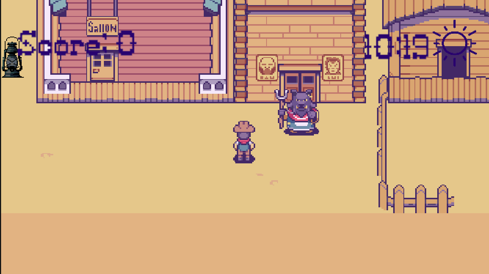
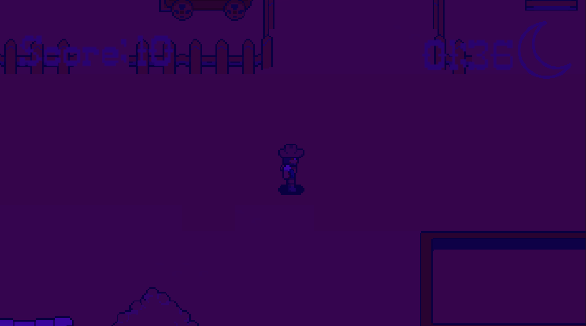

# Wild West Cartoon Game

Cowboygame is a 2D adventure where you, the protagonist, spawn in a Western world to shoot monsters for score. The game features an immersive environment with a map, day and night cycle, various monster types, animations, and interactive menus.

It was developed with by Arthur, Peng, and Theo for the Introduction to Game Development Course at the Leibniz University Hannover during Winter Semester 2023/2024. The game is written in the Unity Engine.

## Features

- 2D Cartoon Graphics: Enjoy a visually appealing cartoon-style Wild West world.
- Dynamic Environment: Experience day and night cycles that affect your gameplay.
- Diverse Monsters: Encounter and shoot multiple types of monsters for points.
- Interactive Map: Navigate through the Western-themed map to find and combat monsters.
- Animations and Menus: Smooth animations and intuitive menus enhance your gaming experience.

## Screenshots

Here are some in-game screenshots:

## Development

How to Play

1. Movement: Use the arrow keys or WASD to move your character around the map.
2. Shooting: Click the mouse to shoot.
3. Objective: Shoot the monsters to gain score. Survive and thrive in the Wild West!

## Controls

- Arrow Keys/WASD: Move the character
- Spacebar/Mouse Click: Shoot
- Escape: Invoke Menu

## Prerequisites

- Unity 2022.3.27f1

---

